  

  
  
  

---

## About Me

- Fresh graduate from **RMIT University**.
- Currently work at **FPT Software**.
- Full-stack developer passionate about building interesting projects and helping solutions.
- Currently deepening my knowledge in building **Agent-driven workflows and solutions** for traditional SDLC. 

---

## Tech Stack

  
   
  
   
  
   
  

---

## GitHub Stats

    

 

  

 

  

---

## GitHub Trophies

  

